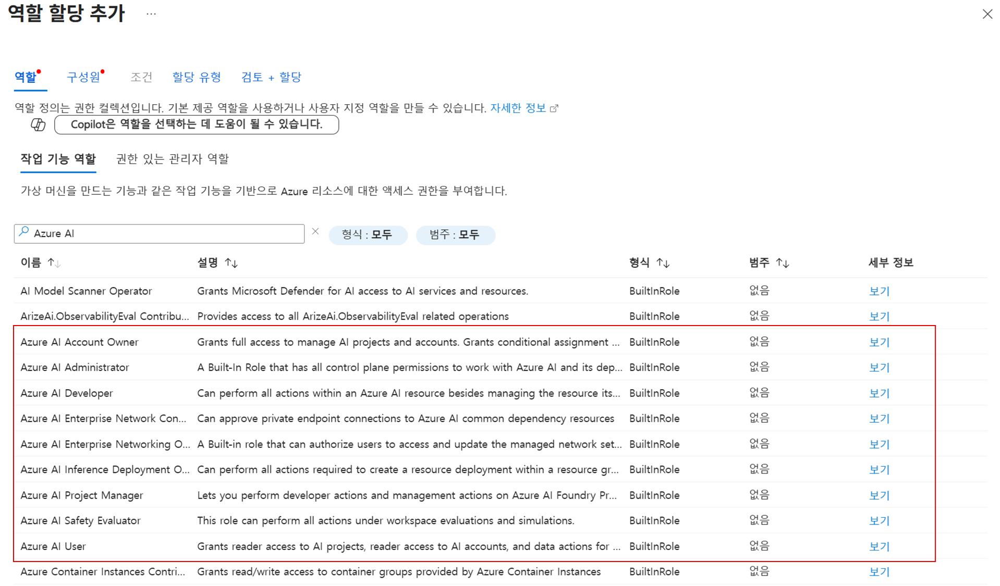

# 1. Azure AI Foundry 구성

### Azure AI Foundry 권한 구성

1. [Azure Portal](https://portal.azure.com)에 접속합니다.
2. 워크샵 계정을 사용해서 포털에 로그인합니다.
3. 상단 검색창에서 `구독`을 입력해서 구독 화면으로 이동합니다.
4. 구독을 선택하고 왼쪽 메뉴에서 `액세스 제어(IAM)`을 클릭합니다.
5. 상단의 `추가` 버튼을 클릭하고, `역할 할당 추가`를 선택합니다.
6. 작업 기능 역할에서 `Azure AI`를 검색합니다. Azure AI Foundry를 사용하기 위해서는 `Azure AI User` 이상의 권한이 필요합니다. 권한을 선택하고 `다음` 버튼을 클릭합니다.
    
    
    
7. 다음에 대한 액세스 할당에서 사용자, 그룹 또는 서비스 주체를 선택하고 `+ 구성원 선택`을 선택하고 본인 계정을 검색한 뒤 `선택` 버튼을 클릭합니다.
8. `다음` 버튼을 클릭하고, `검토 + 할당` 버튼을 클릭합니다.

### Azure AI Foundry 포털 구성

1. [Azure AI Foundry](https://ai.azure.com/) 포털에 접속합니다.
2. 오른쪽 상단의 `새로 만들기` 버튼을 클릭합니다.
3. `Azure AI Foundry 리소스`를 클릭하고 `다음` 버튼을 클릭합니다.
4. 프로젝트 이름을 `<alias>-project`로 입력합니다.
5. 아래 고급 옵션에서 나머지 옵션은 그대로 두고 지역을 `East US 2`로 선택하고 `만들기` 버튼을 클릭합니다. (이 작업은 1~3분 정도 소요됩니다.)
6. 프로젝트가 생성되면 아래와 같은 프로젝트 화면으로 이동됩니다.
    
    
    
7. 프로젝트 세부 정보에서 `리소스 그룹`을 메모장에 복사해 둡니다.