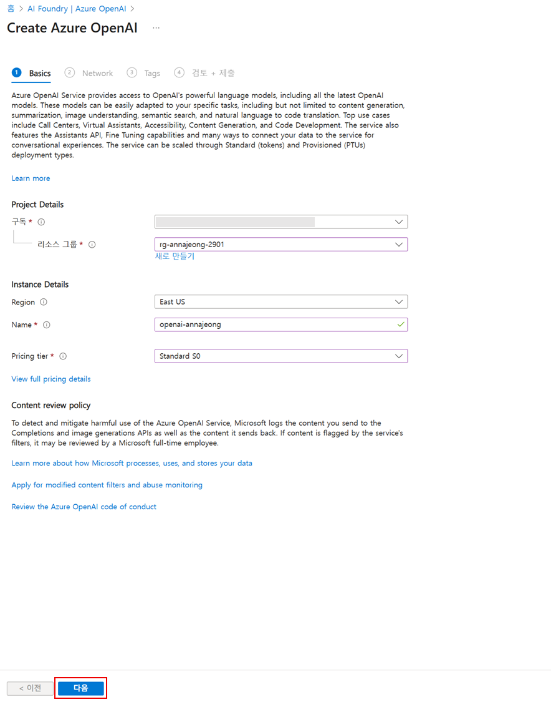

# 2. 플레이그라운드 활용해보기

## 모델 배포

1. Azure AI Foundry 프로젝트 화면 왼쪽 메뉴에서 `모델 카탈로그`를 선택합니다.
2. 모델 검색창에서 `gpt-4`를 입력합니다.
    
    
    
3. `gpt-4o`을 클릭합니다.
    
    
    
4. 모델 화면에서 `이 모델 사용`을 클릭하고 배포 버튼을 클릭합니다.
5. 모델 배포가 완료되면 상단의 `플레이그라운드에서 열기` 버튼을 클릭합니다.
    
    
    

# 재테크 상담 지원 봇 구성해보기

지금부터 구성해 볼 예제는 “재테크 상담 지원 봇”입니다. 고객이 예금, 적금, 펀드, 대출 상품 등에 대해 물어보면 최신 상품 정보와 계산, 비교 등의 응답을 제공합니다.

## 초기 프롬프트 구성

초기 프롬프트는 챗봇이 어떤 역할을 하고, 어떤 톤으로 제약 조건 등을 명확히 하는 부분입니다. 이런 기본 프롬프트를 처음에 세팅해 두고, 이후 RAG를 추가하면 더 구체적으로 “검색된 상품 정보를 반영하라” 등의 조건을 넣을 수 있습니다.

1. 왼쪽 설정 부분에서 배포 아래 `모델에 지침 및 컨텍스트 제공`에 아래 프롬프트를 복사하여 붙여 넣습니다.
    
    ```
    당신은 대한민국 은행의 금융상품 전문가 챗봇입니다. 고객이 예금, 적금, 펀드, 대출 등 금융상품에 대해 질문하면, 다음 기준을 준수하여 답변해 주세요:
    
    정확한 최신 정보 제공 — 상품 금리, 만기, 우대 조건 등을 가능한 최근 기준으로 제시할 것.
    
    정보 출처 명시 — “은행 내부 상품 카탈로그” 등 출처를 밝힐 것.
    
    비교 / 계산 가능하면 간단한 비교표 또는 계산 예제 포함 (예: 이율 차이로 얻을 수 있는 이자액 비교).
    
    고객 이해도 고려 — 어려운 금융 용어는 풀어 설명하고, 고객이 선택지를 잘 판단할 수 있도록 장단점 제시.
    
    정책 / 규제 준수 — 개인정보 보호, 약관, 금리 고지 사항 등을 반영하여 설명할 것.
    ```
    
2. 내용이 반영되면 `변경 내용 적용` 버튼을 클릭합니다.
3. 데이터 추가 전 모델만으로는 아래와 같은 일반적인 질문에 대한 프롬프트를 테스트해 볼 수 있습니다.
    
    ```
    정기예금과 적금의 차이를 간단히 설명해 주세요. 각각의 장점과 단점을 알려주세요.
    
    펀드와 ETF의 주요 차이점과 투자 시 유의해야 할 리스크를 3가지씩 설명해 주세요.
    
    대한민국에서 은행 예금은 어느 기관이 예금자보호를 담당하며, 한도는 얼마인가요?
    
    주택담보대출의 LTV와 DSR 규제의 개념과 현재 한국 금융권에서의 적용 방식을 설명해 주세요.
    
    고객이 ‘월 100만원씩 1년간 예금’할 때 단리 3%와 복리 3%의 예상 이자를 비교해 주세요.
    ```
    

## RAG + 데이터 추가 구성

한국 금융상품 중심으로 접근 가능한 공개 데이터 및 데이터 상품을 다운로드하여 데이터를 추가해 보도록 하겠습니다.

- 금융 합성 데이터 (AI Hub)
    - [https://aihub.or.kr/aihubdata/data/view.do?dataSetSn=71792](https://aihub.or.kr/aihubdata/data/view.do?dataSetSn=71792)
    - 국외 반출이 불가하여 별도로 전달
    - 은행 수신상품, 펀드상품 등 금융상품 정보의 정형 데이터. 예: 상품 코드, 운용사, 금리, 만기, 타입(예금 vs 펀드) 등이 포함
- 데이터 상품 플랫폼
    - [https://github.com/Anna-Jeong-MS/AzureAIFoundryWorkshop-Portal/blob/main/assets/train-00000-of-00001.txt](https://github.com/Anna-Jeong-MS/AzureAIFoundryWorkshop-Portal/blob/main/assets/train-00000-of-00001.txt)
    - 금융 도메인의 뉴스, 금융 보고서, 용어 사전 등이 포함된 문서 + QA 짝으로 구성된 데이터셋. 챗봇 학습 / 평가용으로 유용

### 스토리지 계정 권한 설정

1. 프로젝트를 생성하면 기본적으로 스토리지 계정에 대해 SAS (Key 기반 인증)이 구성되어 있습니다. 이 부분을 Entra ID 기반 인증으로 변경하도록 하겠습니다.
2. 프로젝트 화면 왼쪽 메뉴 하단의 `관리 센터`를 클릭합니다.
3. 허브에서 `Connected resources` 메뉴를 클릭합니다.
4. 리소스 리스트에서 `<alias>-<date>-project/workspaceblobstore`를 클릭합니다.
    
    
    
5. 액세스 세부 정보 섹션에서 오른쪽 상단 `연필 모양 수정 아이콘`을 클릭합니다.
    
    
    
6. 인증 방법을 `Microsoft Entra ID 기반`으로 변경하고 `저장` 버튼을 클릭합니다.

**계정에 스토리지 권한 할당**

1. 브라우저에서 새 탭을 열고 [Azure 포털](https://portal.azure.com)을 엽니다.
2. 상단 검색창에서 `스토리지 계정`을 검색하여 스토리지 센터 화면으로 이동합니다.
3. 리소스 목록에서 생성한 `<alias><date>storage`를 클릭합니다.
4. 왼쪽 메뉴에서 `액세스 제어(IAM)` 메뉴를 클릭합니다.
5. 상단 `추가` 버튼을 클릭하고 `역할 할당 추가`를 클릭합니다.
6. `역할` 탭에서 `Storage Blob 데이터 Contributer`를 검색하여 클릭하고 `다음` 버튼을 클릭합니다.
7. 구성원 탭, 다음에 대한 액세스 할당에서 `사용자, 그룹 또는 서비스 주체`를 선택하고 `+ 구성원 선택`을 클릭합니다.
8. 본인 계정을 입력하여 선택하고 `선택` 버튼을 클릭합니다.
9. `검토 + 할당` 버튼을 클릭합니다.

### **Azure AI 검색 리소스 구성**

1. 추가된 데이터를 모델에서 임베딩하여 검색에 사용할 수 있도록 AI 검색을 구성합니다.
2. 가장 하단의 `새 Azure AI Search 리소스 만들기` 버튼을 클릭합니다.
3. 새 탭이 열리면 본인 계정을 선택하여 로그인합니다.
4. 아래와 같이 검색 서비스를 구성합니다.
    - 구독 : 구독 선택
    - 리소스 그룹 : Azure AI Foundry 구성에서 복사해 둔 리소스 그룹 이름을 선택
    - 서비스 이름 : <alias><date>-aisearch
    - 위치 : (Asia Pacific) Korea Central
5. 나머지 설정은 그대로 두고, `검토 + 만들기` 버튼을 클릭하여 검색 서비스를 생성합니다.

## 데이터 추가

1. 왼쪽 설정 부분에서 데이터 추가 섹션의 `새 데이터 원본 추가` 버튼을 클릭합니다.
2. 데이터 원본 선택에서 `파일 업로드`를 선택합니다.
3. 다운로드 받은 파일을 선택하고 업로드가 완료되면 `다음` 버튼을 클릭합니다.
    
    
    
4. 인덱스 구성 단계에서 생성한 Azure AI Search를 선택합니다.
5. 백터 인덱스 이름에 `finance`를 입력하고 `다음` 버튼을 클릭합니다.
    
    
    
6. 설정 검색 단계에서 포함 모델(임베딩 모델)을 text-embedding-3-large로 변경하고 `다음` 버튼을 클릭합니다.
    
    
    
7. 모든 구성이 완료되면 `벡터 인덱스 만들기` 버튼을 클릭합니다.
    
    
    
8. 구성이 끝나면 다음과 같이 데이터 수집이 진행됩니다.
    
    
    
9. 데이터 추가가 완료되면 아래와 같은 프롬프트를 통해 데이터를 기반으로 응답하는지 확인해 볼 수 있습니다.
    
    ```
    1,000만 원을 12개월 맡길 때 정기예금(단리) vs 월복리 예금의 이자액 차이를 기본금리 / 우대금리 충족 전·후로 비교표로 보여주세요. 기준일과 출처(은행 내부 상품 카탈로그)를 반드시 명시하고, 사용한 계산식도 간단히 알려주세요.
    
    매달 50만 원 적금 24개월 가입 시 모든 우대 충족과 우대 미충족의 만기 수령액을 각각 계산해 주세요. 중도해지 시 적용 금리/수수료도 함께 요약하고, 어려운 용어는 풀어서 설명해 주세요. 출처와 기준일을 명시하세요.
    
    신용대출 5,000만 원·24개월 기준 원리금균등 vs 만기일시상환의 월 납입액·총이자를 비교표로 제시해 주세요. 중도상환수수료, DSR 영향을 쉬운 말로 설명하고, 출처(은행 내부 상품 카탈로그)와 기준일을 표기하세요.
    
    외화예금(USD) 10,000달러 가입 시 환율 스프레드와 환전 우대 90% 적용을 감안한 실제 원화 납입액을 계산 예시로 보여주세요. 환리스크·수수료 유의사항을 정리하고, 출처와 기준일을 명시해 주세요.
    ```
    
    
    

### 재테크 상담 지원 봇 배포

이제 구성한 재테크 상담 지원 봇을 배포해보도록 하겠습니다.

1. 상단의 `배포` 버튼을 클릭하고 `…웹앱으로` 버튼을 클릭합니다.
2. 아래와 같이 구성하고 `배포` 버튼을 클릭합니다.
    - 이름 : FinPilot-<alias>
    - 구독 : 본인 구독 선택
    - 리소스 그룹 : Azure AI Foundry 구성에서 복사해 둔 리소스 그룹 이름을 선택
    - 위치 : Korea Central
    - 가격 책정 플랜 : Standard (S1)
    - 웹앱에서 채팅 기록 사용 체크
    
    
    
3. 상단 웹앱 배포 중 알림의 `배포 탭`을 클릭하여 배포 상태를 확인할 수 있습니다.
    
    
    
4. 리스트에서 `FinPilot-<alias>` 의 관리(Azure Portal)를 클릭합니다.
5. 왼쪽 메뉴에서 `설정 > 인증`을 클릭합니다.
6. `ID 공급자 추가` 버튼을 클릭합니다.
7. ID 공급자에서 `Microsoft`를 클릭하고 아래와 같이 구성합니다.
    - 애플리케이션 및 해당 사용자에 대한 테넌트 선택 : 인력 구성(현재 테넌트)
    - 항목이 뜨지 않을 경우 생략
        - 앱 등록 유형 : 새 앱 등록 만들기
        - 이름 : FinPilot-<alias>
        - 서비스 트리 ID :
    - App Service 인증 설정 > 액세스 제한 : 인증되지 않은 액세스 허용
8. 나머지 설정은 그대로 두고 `추가` 버튼을 클릭합니다.
9. 다시 Azure AI Foundry 포털로 돌아와 웹앱 리스트에서 `FinPilot-<alias>`를 클릭하면 새 탭에서 [`https://finpilot-<alias>.azurewebsites.net/`](https://finpilot-annajeong.azurewebsites.net/) 사이트가 열리고 화면을 확인할 수 있습니다.
    
    