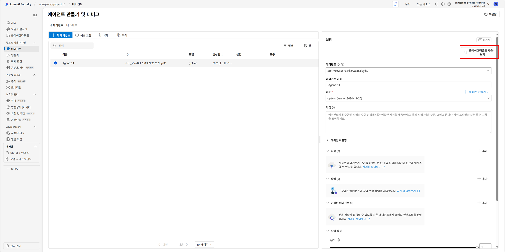

# 3. 첫번째 에이전트 구현해보기

### 에이전트 플레이그라운드

1. 브라우저 새 탭에서 [Azure AI Foundry](https://ai.azure.com) 포털을 엽니다.
2. 생성한 프로젝트 화면으로 이동하고 왼쪽 메뉴에서 `에이전트`를 클릭합니다.
3. 초기 진입시 기본 에이전트 프로젝트 OpenAI 엔드포인트에 모델 배포를 필요로 합니다. 
4. gpt-4o를 선택하고 `확인` 버튼을 클릭하고, `배포` 버튼을 클릭하여 배포를 완료합니다.
5. 모델을 배포하면 기본 에이전트가 배포됩니다. 해당 에이전트를 클릭하고 `플레이그라운드 사용해보기` 버튼을 클릭합니다.
    
    
    

## **에이전트 플레이 그라운드 소개**


**지침(Instruction)**

모델이 따를 **행동 규칙(시스템 프롬프트)** 입니다. 도구를 언제/어떻게 쓰는지, 말투/가드레일을 비롯한 실행 지침을 담습니다. 실행 시 실제로 모델에 전달되어 응답에 직접 영향을 줍니다.

**에이전트 설명(Description)**

사람/카탈로그용 요약입니다. 포털/VS Code 등에서 에이전트를 식별·정의하는 메타데이터로, 동작에는 영향이 없습니다. (이름·설명·태그 등)

**지식(Knowledge)**
에이전트가 참고할 **외부 지식원**을 붙입니다. 대표적으로 **File search(파일 업로드·인덱스화)**, **Azure AI Search**, **Bing 기반 웹 그라운딩**, Microsoft Fabric 등. 파일 업로드는 포털에서 지식 섹션에 추가하면 자동으로 검색 가능한 형태로 관리됩니다.

**작업(Tasks)**

- 에이전트가 **실제로 수행할 수 있는 일(액션)** 을 정의합니다. 예) **Code Interpreter(코드 실행)**, **OpenAPI 도구**, **Logic Apps 액션(워크플로 실행)**, **MCP 도구** 등.
- 특히 Logic Apps와 연결하면 1,400+ 커넥터로 메일 발송·티켓 생성 같은 **업무 자동화 작업**을 에이전트가 호출할 수 있습니다.

**연결된 에이전트(Connected agents)**

메인 에이전트가 **특정 작업을 다른 에이전트에 위임**하도록 구성합니다. 포털의 *Connected agents* 섹션에서 하위 에이전트를 선택하고 “언제/왜 호출할지” 설명을 적어 주면, 런타임에 자연어 라우팅으로 위임됩니다. 

**모델 설정(Model settings)**
사용 모델과 **샘플링 옵션(예: temperature, top_p)** 등을 지정합니다. VS Code/포털 모두에서 모델과 옵션이 에이전트 정의에 포함되며, 이 값이 응답의 창의성·결정성에 영향을 줍니다.

## 카드회원 분석 에이전트 구현

이 에이전트에서 사용할 데이터는 다음과 같습니다. 두 데이터는 발급회원번호와 기준년월을 공통키로 가지며 이를 **결합한 단일 테이블**로 활용합니다. 이를 통해 아래와 같은 분석이 가능합니다.

- 특정 연령대·지역·VIP 등급별 **평균 카드 한도** 분석
- **마케팅 동의 상태**와 **한도 증액 요청 빈도**의 상관관계
- 최근 3개월 사용금액(`user_info.csv`)과 **한도금액(`credit_info.csv`)** 비교

**결합된 카드 회원/신용정보**

- 조인 키: `발급회원번호`, `기준년월`
- 주요 속성
    - 프로필 정보: 익명화된 ID, 연령, 지역, 성별, VIP 등급
    - 마케팅 동의 상태, 카드 보유 정보
    - 최근 3개월 사용금액
    - 신용 한도, 한도 증액 요청 횟수, 이용 및 연체 내역

※ 이름 등 직접 식별자는 포함되지 않으며, 익명화된 ID 기반으로 분석이 이루어집니다.

### 카드회원 분석 에이전트 구현

1. 에이전트 플레이그라운드에서 앞 단계에서 생성한 에이전트가 선택되어 있는지 확인합니다.
2. 오른쪽 설정 패널에서 에이전트 이름을 `CreditProfileAgent`로 입력합니다.
3. 지침 항목에 아래 내용을 복사하여 붙여 넣습니다.
    
    ```
    항상 한국어로 응답합니다.
    
    데이터가 충분하지 않더라도, 가능한 범위에서 실제 수치/집계 결과를 보여줍니다.
    
    예: 조건에 맞는 데이터가 없으면 → “평균 한도금액은 계산할 수 없으며, 표본 수(N)=0입니다.”
    
    절대로 “곧 업데이트드릴게요”, “더 구체적 데이터가 필요합니다” 와 같이 추상적/회피성 문구로만 응답하지 않습니다.
    
    응답은 항상 표 형태 또는 수치와 함께 한 줄 요약으로 제시합니다.
    
    필터 조건에 해당하는 레코드가 없으면, N=0을 명시하고 계산 불가임을 표시합니다.
    ```
    
4. 에이전트 설명에 아래 내용을 복사하여 붙여 넣습니다.
    
    ```
    이 에이전트는 user-info 데이터를 기반으로, 고객군별 평균 카드 한도, 마케팅 동의와 한도 증액 요청의 관계, 최근 3개월 사용금액 대비 한도금액 비율 등을 집계합니다.
    응답은 항상 한국어로 제공되며, 실제 데이터 값 또는 N=0, 계산 불가와 같은 명확한 결과를 보여줍니다.
    데이터가 부족하더라도 결과를 회피하지 않고, 가능한 범위 내에서 집계 수치와 표본 수를 표시합니다.
    ```
    

### 데이터 구성

챗봇에서 업로드한 데이터를 효율적으로 검색·활용할 수 있도록 벡터 저장소에 추가합니다.

**데이터 추가**

1. 브라우저 탭에서 **Azure AI Foundry 포털**로 돌아옵니다.
2. 에이전트 플레이그라운드에서 앞 단계에서 생성한 에이전트가 선택되어 있는지 확인합니다.
3. 아래 지식 섹션의 `추가` 버튼을 클릭합니다.
4. **지식 추가 화면**에서 `파일`을 선택합니다.
5. `user_card_credit_summary_sample.json` 파일을 선택하고 업로드 및 저장 버튼을 클릭합니다.

### 에이전트 테스트

1. 이제 임베딩된 데이터가 잘 참조되는지 아래 프롬프트를 통해 에이전트를 실행해 보도록 하겠습니다.
    
    ```
    40대 VIP 등급 코드 07인 회원들의 평균 이용한도와 일시상환론 금액을 알려줘. 그리고 이들의 라이프스테이지 분포도 함께 보여줘.
    
    최근 카드 발급 경과월이 5개월 이하이고 단기연체 여부(6M)가 1인 회원 정보를 찾아 요약해줘. 회원번호, 연령대, 이용한도, 연체 관련 필드만 표시해.
    
    자녀성장기(1)와 자녀성장기(2) 단계에 있는 30대와 40대 회원들의 평균 이용한도를 비교해 보고, 한도가 높은 순으로 라이프스테이지와 연령대 조합을 정렬해줘.
    ```
    
2. 아래와 같이 업로드한 데이터에 기반하여 응답을 생성하는 것을 확인할 수 있습니다.
    
    
    
    