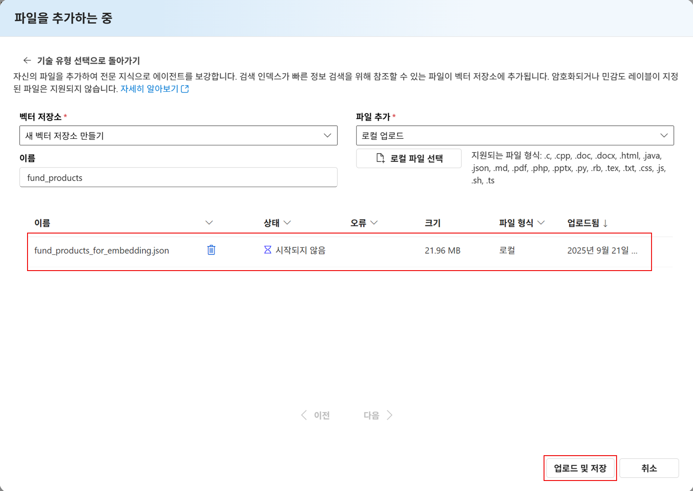

# 4. 멀티 에이전트 구현해보기

멀티 에이전트는 역할이 다른 에이전트들이 메시지로 협업해 문제를 단계적으로 해결하는 아키텍처입니다.

이번 실습은 AI Hub 금융 합성 데이터를 사용해 카드·신용 정보를 바탕으로 페르소나를 도출하고, 그 결과로 맞춤형 금융 상품을 추천합니다.

마지막으로 마케팅 메일 에이전트가 추천 요약을 고객에게 전달하는 흐름까지 구현합니다.

모든 단계에서 근거·기준일 명시와 개인정보 최소 수집/고지를 준수합니다.

# 멀티 에이전트 구현

첫번째 에이전트를 통해서 페르소나를 도출하여 상품을 추천할 예정입니다. 페르소나 도출을 위해 사용할 수 있는 프롬프트는 아래와 같습니다.

```
VIP 등급 코드가 07이고, 이용한도가 5백만 원 이상인 사용자를 추출해줘. 회원번호와 라이프스테이지를 함께 보여줘.

40대 자녀성장기(1) 단계에 있는 여성 회원 중 최근 카드 발급 경과월이 12개월 이하인 사용자를 찾아줘.

최근 6개월 단기연체 여부가 1인 사용자를 추출하고, 회원번호·연령대·이용한도를 정리해줘.

이용한도가 1천만 원 이상이고 일시상환론 금액이 5백만 원 이상인 사용자를 찾아줘.

20대 가족형성기 단계의 남성 회원 중 카드 신청 건수가 1건 이상인 사용자를 뽑아줘.

60대 이상 노령 라이프스테이지 회원 중 이용가능 회원만 추려줘.

VIP 코드가 06 이상이면서, 최근 24개월 내 발급된 카드 회원 중 연체 이력이 전혀 없는 사용자를 추출해줘.
```

이런 식으로 프롬프트를 입력하게 되면, 조건별로 추출된 사용자를 **공모 펀드 상품**의 특정 속성과 매핑해 추천 로직을 구성하면, 예를 들어 "안정적 수익형 상품 → 노령층", "성장형 상품 → 20~30대"처럼 연결할 수 있습니다.

## 상품 추천 에이전트 구현하기

이 에이전트에서 사용할 데이터는 `fund_products_for_embedding.json`이며, 이는 `공모펀드상품.csv`를 임베딩하기 적합한 구조(`id`, `text`, `metadata`)로 변환한 단일 테이블입니다.

**결합된 공모펀드 상품 정보**

- **조인 키**
    - `상품코드` (id)
- **주요 속성**
    - **기본 정보**: 상품코드, 상품명
    - **투자 속성**: 유형(대유형), 자산유형, 투자위험등급
    - **전략/테마**: 스타일_테마, 지역, 벤치마크, 환헤지 여부
    - **운용 정보**: 운용사, 보수·수수료

**분석 가능 항목**

- 위험등급별, 지역별, 자산유형별 **펀드 상품 분포 및 추천 로직** 분석
- 특정 연령대·VIP 등급·라이프스테이지 사용자와 **적합한 펀드 속성 매핑**
- 수수료(보수) 및 운용사 기준으로 상품 특성 비교

1. 브라우저에서 **Azure AI Foundry** 포털 탭으로 이동합니다.
2. 왼쪽 메뉴에서 `에이전트`를 클릭합니다.
3. `새 에이전트` 버튼을 클릭하고 `플레이그라운드 사용해보기` 버튼을 클릭합니다.
4. 에이전트 이름을 `FundRecommendationAgent`로 입력합니다.
5. **지침**에 아래 내용을 복사하여 붙여 넣습니다.
    
    ```
    역할: 연결된 에이전트(CreditProfileConnector)로부터 조건에 맞는 사용자 페르소나를 가져오고,
    지식에 업로드된 fund_projects을 이용해 해당 사용자에게 적합한 공모펀드 상품을 한국어로 추천한다.
    
    동작 절차:
    1) 사용자의 자연어 요청에서 타깃 사용자 조건(연령대/성별/지역/VIP/마케팅동의/이용한도/연체/Life_Stage 등)을 추출한다.
    2) 연결된 에이전트 'CreditProfileConnector'에 서브프롬프트로 질의하여 JSON 배열 형태의 사용자 페르소나를 수신한다.
    3) 수신한 페르소나(최대 10명 기준)를 바탕으로, 아래 기준으로 펀드 후보를 필터링한다:
       - 위험등급(보수적/안정형/중립/적극적/공격적)
       - 자산유형(채권형/주식형/혼합형/멀티에셋 등)
       - 지역(국내/글로벌/신흥국 등)
       - 스타일_테마(배당/인컴/성장/퀄리티/저변동/테크 등)
       - (가능 시) 보수_수수료, 벤치마크, 환헤지
    4) 후보를 3~5개로 요약 추천하고, “사용자 조건 ↔ 펀드 속성” 매핑 근거를 한국어로 설명한다.
    5) 응답 구조:
       - [요약] 사용자 조건
       - [추천] 펀드 3~5개 (상품명, 핵심 속성, 간단 사유)
       - [근거] 어떤 규칙/속성 매핑으로 추천했는지
    
    규칙:
    - 반드시 한국어로 답변한다.
    - CreditProfileConnector로부터의 응답(JSON)이 비거나 0명일 경우, 사유를 말하고 대체 조건(예: 범위 완화)을 제안한다.
    ```
    
6. **에이전트 설명**에 아래 내용을 복사하여 붙여 넣습니다.
    
    ```
    연결된 에이전트(CreditProfileConnector)에서 조건에 맞는 사용자 페르소나를 받아,
    임베딩된 공모펀드 상품 데이터(fund_productn)와 속성 매핑으로
    맞춤형 펀드를 추천합니다. 모든 답변은 한국어로 제공합니다.
    ```
    

### 데이터 추가

1. **지식 섹션**에서 `추가` 버튼을 클릭합니다.
2. 지식 추가 화면에서 `파일`을 선택합니다.
3. 파일 추가에서 `로컬 파일 선택` 버튼을 클릭하고, `fund_products_for_embedding.json` 파일을 선택합니다.
4. 벡터 저장소 이름을 `fund_products`로 입력합니다.
5. 구성이 완료되면 `업로드 및 저장` 버튼을 클릭합니다.
    
    
    

### 에이전트 연결

1. **연결된 에이전트** 섹션에서 `추가` 버튼을 클릭합니다.
2. **에이전트 선택**에서 `CreditProfileAgent`를 선택합니다.
3. **고유 이름**에 `CreditProfileConnector`를 입력합니다.
4. **에이전트를 활성화하는 단계를 자세히 설명합니다.** 에 아래 내용을 복사하여 붙여 넣습니다.
    
    ```
    이 연결은 임베딩 지식을 사용하는 CreditProfileAgent에 질의하여 사용자 조건(연령대/성별/지역/VIP/마케팅동의/이용한도/연체/Life_Stage 등)에 맞는 사용자 페르소나를 JSON 배열로 반환받기 위한 것입니다. 반환된 페르소나는 상위 에이전트(FundRecommendationAgent)에서 펀드 속성과 매핑되어 추천에 활용됩니다.
    동작 순서: (1) FundRecommendationAgent가 자연어 요구에서 조건을 추출 (2) 서브프롬프트 템플릿에 맞춰 CreditProfileConnector 호출 (3) CreditProfileAgent가 조건에 맞는 최대 10명 사용자 반환 (4) 상위 에이전트가 JSON을 검증 후 추천 프로세스 진행 (5) 결과가 없거나 스키마 불일치 시 예외 처리 또는 조건 완화 제안.
    서브프롬프트 템플릿: “다음 조건의 사용자 10명 이내 JSON 배열만 반환하세요. 설명 없이 JSON만 출력, 키는 한글로 고정.” 조건 예: 연령대, 성별, 지역, VIP등급코드, 마케팅동의여부, 최근3개월사용금액, 이용한도, 단기연체여부(6M), Life_Stage.
    반환 스키마: 회원번호, 기준년월, 연령대, 성별, 지역, VIP등급코드, 마케팅동의여부, 최근3개월사용금액, 이용한도, 단기연체여부(6M), Life_Stage.
    규칙: 반드시 한국어 응답, JSON 배열만 출력, 결과 없으면 [] 반환, 10명 초과 금지.
    ```
    
5. 구성이 완료되면 `추가` 버튼을 클릭합니다.
    
    
    

### 에이전트 테스트

모든 구성이 완료되면 아래와 같은 최상위 프롬프트를 활용하여 에이전트를 테스트할 수 있습니다.

```
40대 VIP 등급 코드 07인 사용자를 대상으로 적합한 펀드를 추천해줘.  
연체 이력은 없어야 하고, 성장형 위주의 글로벌 주식형이면 좋아.
```

```
자녀성장기(1) 단계의 30대 고객에게 균형형(혼합형) 펀드 3가지만 추천해줘.
```

