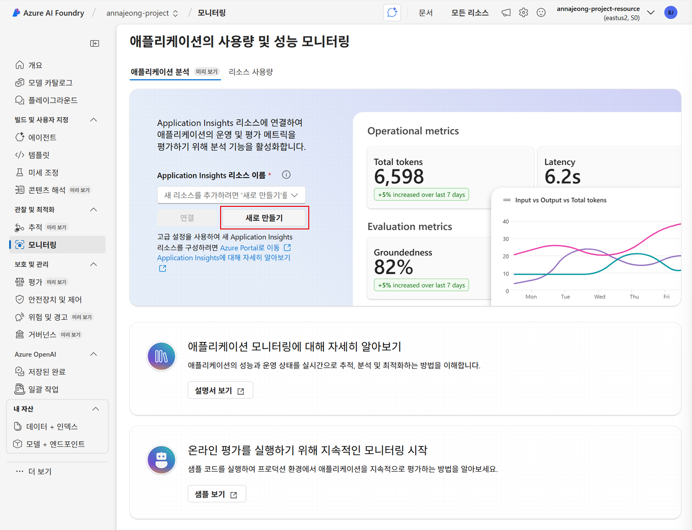

# 5. 모니터링과 평가

AI 업계의 복잡성과 빠른 발전으로 인해 **생성형 AI 애플리케이션을 모니터링하는 중요성은 그 어느 때보다 커지고 있습니다.**

Azure Monitor Application Insights와 통합된 **Azure AI Foundry Observability**를 활용하면, 배포된 AI 애플리케이션을 지속적으로 모니터링하여 **성능, 안정성, 품질**을 보장할 수 있습니다.

또한, 단순한 모니터링을 넘어 **에이전트에 대한 지속적인 평가 기능**도 제공하여 Foundry Observability 대시보드를 한층 강화하고, **추가적인 품질 및 안전 메트릭**을 표시해 프로덕션 환경에서 더욱 신뢰할 수 있는 결과를 지원합니다.

## 모니터링

Azure AI Foundry 프로젝트에서 Application Insights를 프로젝트에 연결하면 토큰/지연시간/예외/품질 신호가 대시보드에 집계됩니다.

이후 추적 기능을 활용하면 모니터링 기본 대시보드에서 기간/모델/애플리케이션 필터를 적용해 지표를 확인하고, 이상 징후가 보이면 추적으로 이동해 세부 호출 흐름을 디버깅합니다. 필요 시 **View in Azure Monitor Application Insights**로 넘어가 KQL로 심층 분석 및 워크북 커스터마이징/공유를 수행할 수 있습니다.

애플리케이션 분석에서 수집되는 데이터는 아래와 같습니다.

| 범주 | 예시 항목 | 전송 조건 |
| --- | --- | --- |
| **요청(Requests)** | REST API/에이전트 호출 수, 응답 시간, 상태 코드(200/400/500) | SDK, OpenTelemetry, 또는 Azure Monitor에 Request Telemetry를 보내야 합니다. |
| **종속성(Dependencies)** | 백엔드 호출 (예: DB 쿼리, 스토리지 요청) | 코드 또는 Agent 실행 경로에서 Dependency Telemetry를 수집하도록 설정해야 합니다. |
| **예외(Exceptions)** | 호출 오류, 런타임 예외 | 예외 로깅 또는 TrackException 호출 필요 |
| **추적/로그(Traces)** | 사용자 정의 로그, 단계별 메시지 | Application Insights SDK/Logger를 사용하여 TrackTrace 또는 Logger 전송 |
| **사용자/세션(User/Session)** | 사용자 수, 세션 수, 지역별 분포 | Web SDK 또는 클라이언트 쪽 Telemetry가 활성화돼야 집계 |
| **커스텀 이벤트(Custom Events & Metrics)** | 비즈니스 이벤트, 커스텀 카운터 | TrackEvent, TrackMetric 등을 통해 수동 전송 |

1. 브라우저에서 **Azure AI Foundry 포털 탭**으로 이동합니다.
2. 왼쪽 메뉴에서 `모니터링`을 클릭합니다.
3. Application Insight 리소스 이름 하단의 `새로 만들기` 버튼을 클릭합니다.
    
    
    
4. 이름에 `Agent-ApplicationInsights`를 입력하고 `만들기` 버튼을 클릭합니다.

※ 단순히 Azure AI Foundry 에이전트를 호출하는 것만으로는 **자동으로 Application Insights로 기록되지 않습니다**. Agent 호출 결과가 Azure Monitor에 Forward되려면, Foundry에서 **Observability 연결**이 활성화되어 있어야 합니다.

**진단 설정 구성**

1. 브라우저에서 새 탭을 열어 [Azure Portal](https://portal.azure.com)에 접속합니다.
2. 상단 검색창에서 `AI Foundry`를 입력해 **AI Foundry 화면**으로 이동합니다.
3. 왼쪽 메뉴에서 `AI Foundry` 를 클릭합니다.
    
    
    
4. 리스트에서 생성한 `<alias>-project-resource`를 클릭합니다.
5. 왼쪽 메뉴에서 `모니터링 > 진단 설정`을 클릭합니다.
6. 아래와 같이 구성 후 `저장` 버튼을 클릭합니다.
    
    
    
    - 진단 설정 이름 : AIFoundryLogs
    - 로그 : Audit / allLogs
    - 메트릭 : AllMetrics
    - 대상 세부 정보
        - Log Analytics 작업 영역에 보내기

**모니터링 구성 확인**

1. 브라우저에서 `Azure AI Foundry 탭`으로 이동합니다.
2. 모니터링 데이터를 쌓기 위해 왼쪽 메뉴에서 `플레이그라운드`를 선택합니다.
3. 에이전트 플레이그라운드에서 `FundRecommendationAgent`를 선택하고 아래 프롬프트들을 실행합니다.
    
    ```
    40대 VIP 등급 코드 07이고 단기연체여부(6M)=0인 사용자에게 적합한 글로벌 성장형 펀드를 추천해줘.
    
    마케팅 동의=1이고 최근 3개월 사용금액이 300만원 이상인 30대 고객에게 추천할 만한 펀드를 알려줘.
    
    최근 6개월 내 단기연체여부(6M)=1인 50대 고객에게 안정형 채권형 펀드를 추천해줘.
    
    자녀성장기(1)에 있는 30대 고객에게 균형형(혼합형) 펀드 상품을 3개 추천해줘.
    
    이용한도가 상위 그룹에 속하는 VIP 고객에게 공격적 성향의 글로벌 주식형 펀드를 추천해줘.
    
    20대 Single 고객 중 연체 이력이 없는 사람에게 테크/성장 테마 펀드를 추천해줘.
    
    70대 이상 고객 중 VIP 코드가 99인 사용자를 찾아 펀드를 추천해줘.
    
    ```
    

7. 실행 데이터가 수집되는데 약 5분 정도가 소요됩니다.

**역할 구성**

1. `모니터링` 메뉴를 클릭합니다.
2. 애플리케이션 분석 화면 하단에서 `Azure Monitor Application Insights에서 보기`를 클릭합니다.
3. 새 탭에서 **Agent-ApplicationInsights 화면**이 열리면 왼쪽 메뉴에서 `액세스 제어(IAM)`을 클릭합니다.
4. `추가 > 역할 할당 추가`를 클릭합니다.
5. `독자`를 클릭하고 `다음` 버튼을 클릭합니다.
6. 구성원에서 `사용자, 그룹 또는 서비스 주체`를 선택하고 `구성원 선택`을 클릭합니다.
7. 본인 계정을 검색하여 선택하고 `선택` 버튼을 클릭합니다.
8. `검토 + 할당` 버튼을 클릭하여 역할 구성을 완료합니다.

### 애플리케이션 성능 평가 및 비교

Azure AI Foundry에서는 AI 품질 평가를 위해 **모델 레이블 지정자, 모델 채점자**뿐만 아니라 **문자열 검사, 텍스트 유사성, 안전·윤리적 콘텐츠 검증**을 위한 다양한 평가자를 제공합니다.

생성한 **FundRecommendationAgent**를 평가하기 위해 **Likert 배율 계산기**를 활용해보도록 하겠습니다.

Likert 배율 계산기는 사람이 응답의 품질을 **1점(매우 나쁨)에서 5점(매우 좋음)**과 같은 척도로 평가할 수 있도록 하여, **정성적인 판단을 정량화**하는 역할을 합니다. 이를 통해 응답의 관련성, 설득력, 신뢰성을 수치로 비교·분석할 수 있습니다.

그렇기 때문에 **정답이 하나로 고정되지 않고 여러 대안이 존재할 수 있는 금융상품 추천 시나리오**에서는, 사람의 직관적 판단을 반영한 품질 측정이 가능해져 **FundRecommendationAgent 평가에 특히 적합합니다.**

1. 왼쪽 메뉴에서 `평가`을 클릭합니다.
2. 생성형 AI 솔루션 평가에서 `새 평가 만들기`를 클릭합니다.
3. 현재 **모델 평가**와 **기존 쿼리-응답 데이터 세트 평가**를 사용할 수 있습니다.
    - `모델 평가` : 모델 그 자체의 성능을 다양한 프롬프트/지표로 확인
    - `기존 쿼리-응답 데이터 세트 평가` : 
    준비된 Q/A 데이터셋과 실제 결과를 비교해 **서비스 품질**을 측정
4. `기존 쿼리-응답 데이터 세트 평가`를 선택하고 `다음` 버튼을 클릭합니다.
5. **테스트 데이터 구성 화면**에서 `새 데이터 세트 업로드` 버튼을 클릭합니다.
6. 다운로드 받은 `fund_products_eval_sample.jsonl`를 선택합니다.
7. 데이터 세트 업로드가 완료되면 `다음` 버튼을 클릭합니다.
8. **평가자 구성 화면**에서 테스트 조건 아래에 `추가` 버튼을 클릭합니다.
9. `Likert 배율 계산기`를 선택합니다.
    
    
    

1. Likert 배율 계산기를 아래와 같이 구성합니다.
    
    
    
    - 조건 이름 : FundRec_Likert_v1
    - 사전 설정 : 근거성
    - 다음으로 등급 지정 : gpt-4o (프로젝트에 배포된)
    - 컨텍스트 : {{item.context}}
    - 쿼리 : {{item.query}}
    - 응답 : {{item.response}}
    - 통과 등급 : 3
2. 구성이 완료되면 `추가` 버튼을 클릭하고 화면 하단의 `다음` 버튼을 클릭합니다.
3. 모든 구성이 완료되면 `제출` 버튼을 클릭합니다.
    
    
    

1. 평가가 완료되면 다음과 같이 평가 결과를 확인할 수 있습니다.
    
    
    
    
    

**연속 평가 구성**

평가할 지표(예: Relevance/Fluency/Coherence)를 선택해 **에이전트 런마다 샘플링 평가**가 수행되도록 구성합니다. Azure AI Projects 클라이언트로 평가 요청을 생성하면, 결과는 Application Insights의 **traces** 테이블(`gen_ai.evaluation.result`)로 흘러갑니다. 샘플링 비율/시간당 최대 평가 건수도 지정할 수 있습니다.

**KQL로 결과 조회**

```sql
traces
| where message == "gen_ai.evaluation.result"
| where tostring(customDimensions["gen_ai.thread.run.id"]) == "<run_id>"

```

**에이전트 특화 평가**

1. 에이전트 전용 평가자 사용
    - **Intent Resolution**: 사용자 의도(예: “페르소나 조회 → 펀드 추천”)를 올바르게 해석했는지
    - **Tool Call Accuracy**: **CreditProfileConnector** 호출이 적절했고 파라미터가 맞았는지
    - **Task Adherence**: 지침대로 사용자 추출→매핑→추천을 일관되게 수행했는지
        
        점수(1–5)와 pass/fail, 사유(reason)를 제공합니다. 
        
2. 권장 임계값
    - Intent/Task ≥ **4.0**, ToolCallAccuracy ≥ **4.0** (초기 기준) → 미달 시 프롬프트/연결 설명 강화
3. 연속 평가 + 에이전트 평가자

위 평가자들을 연속 평가에 포함해 **운영 중 퀄리티 저하**를 조기 탐지합니다.

[https://learn.microsoft.com/ko-kr/azure/ai-foundry/how-to/continuous-evaluation-agents](https://learn.microsoft.com/ko-kr/azure/ai-foundry/how-to/continuous-evaluation-agents)

**안전·근거성**

**Content Safety**로 유해/규정위반 콘텐츠를 점검하고, **Groundedness(Pro)** 로 추천 사유가 근거(Context)에 부합하는지 자동 감지합니다.

[https://learn.microsoft.com/ko-kr/azure/ai-foundry/openai/concepts/content-filter](https://learn.microsoft.com/ko-kr/azure/ai-foundry/openai/concepts/content-filter)